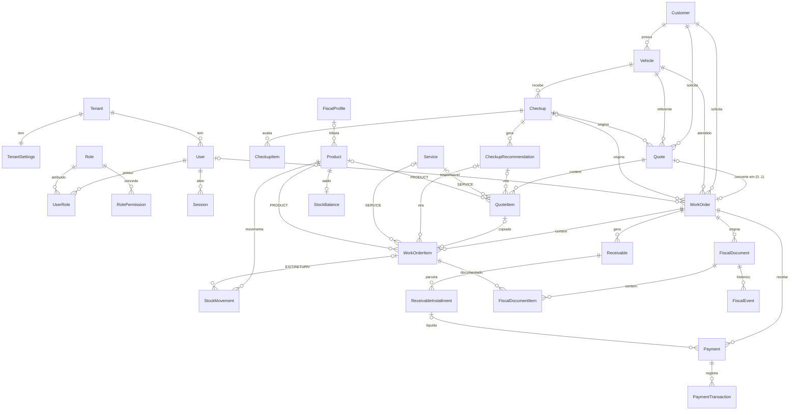
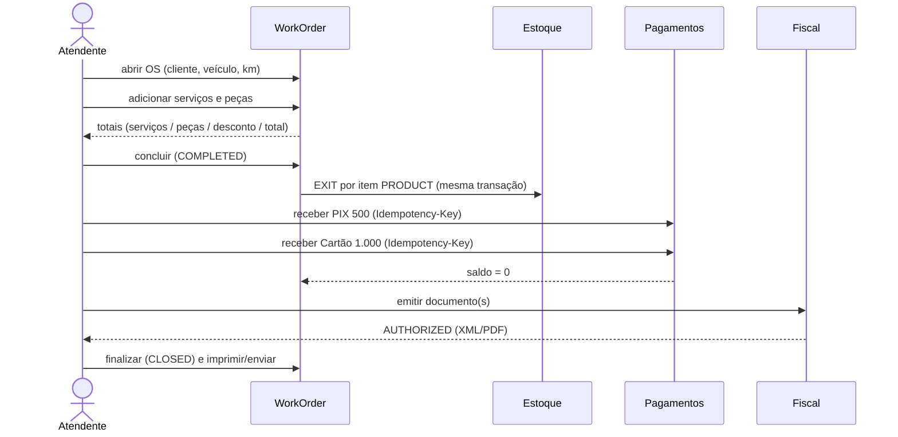

# ZTech Mecânica — Proposta de Modelo de Dados do Núcleo Operacional

> Status: **proposta — aguardando aprovação** (rodada de 2026-10-02).
> Este documento **não** cria tabelas. Ele propõe entidades, relacionamentos e regras para aprovação. Após aprovação, o conteúdo aprovado é incorporado a `docs/database/entidades.md` e `docs/database/modelo-dados.md`, e só então o `schema.prisma` é escrito, por fase (P0 → P6).

## 1. Princípios aplicados

Todos já aprovados em `docs/decisions/ADR-001-stack.md`, `docs/database/modelo-dados.md` e `docs/architecture/*`:

- PostgreSQL 16 + Prisma; `id` UUID v7 gerado na aplicação;
- `tenantId` não nulo e indexado em toda tabela operacional; enforcement centralizado na camada Prisma/repositório; preparado para RLS;
- valores monetários `Decimal(12,2)`, quantidades `Decimal(12,3)` — nunca `float`;
- `createdAt`/`updatedAt` em todas as tabelas; exclusão lógica (`status`) onde houver histórico;
- unicidades de negócio são **por tenant** (`@@unique([tenantId, ...])`);
- FKs compostas com `tenantId` onde a referência cruza entidades do tenant, para que o banco também impeça vínculo entre tenants (ex.: `WorkOrder(tenantId, customerId) → Customer(tenantId, id)`).

---

# 2. Entidades por prioridade

Avaliação da lista sugerida, sem duplicar entidades existentes:

|Sugerida|Proposta|Fase|Observação|
|-|-|-|-|
|Tenant|`Tenant`, `TenantSettings`|P0|Campos ainda não documentados — ver §3.1 (conflito C11)|
|User|`User`|P0|idem|
|—|`Role`, `UserRole`, `RolePermission`|P0|RBAC (`docs/architecture/autorizacao.md`)|
|Session|`Session`|P0|Já especificada (`docs/architecture/autenticacao.md` §4.1); ganha FKs para `User`/`Tenant`|
|—|`AuditLog`|P0|Exigida por `docs/architecture/seguranca.md` §8|
|—|`TenantSequence`|P0|Numeração por tenant (OS-000123, ORC-000045, CLI-000001, SRV-, PRD-)|
|Customer|`Customer` (+ contatos/endereço)|P1|Já especificado em `docs/modules/clientes.md`|
|Vehicle|`Vehicle`|P1|Já especificado em `docs/modules/veiculos.md`|
|Checkup|`Checkup`, `CheckupItem`, `CheckupRecommendation`|P1|§5|
|Service|`Service`|P2|`docs/modules/servicos.md`|
|Product|`Product`|P2|`docs/modules/produtos.md`|
|Quote / QuoteItem|`Quote`, `QuoteItem`, `QuoteStatusHistory`|P2|`docs/modules/orcamentos.md`|
|WorkOrder / WorkOrderItem|`WorkOrder`, `WorkOrderItem`, `WorkOrderStatusHistory`|P2|`docs/modules/ordens-servico.md`|
|Inventory|`StockBalance`|P3|Renomeada: "Inventory" no jargão costuma significar contagem/inventário físico|
|InventoryMovement|`StockMovement`|P3|§4|
|FinancialEntry|`Receivable`, `ReceivableInstallment`, `Payable`*, `CashRegister`*, `CashSession`*|P4|Separado por natureza (§6). *Só o esqueleto nesta proposta|
|Payment / PaymentTransaction|`Payment`, `PaymentTransaction`|P4|§6|
|FiscalDocument / Item / Event|`FiscalDocument`, `FiscalDocumentItem`, `FiscalEvent`, `TenantFiscalSettings`, `FiscalProfile`|P5|§7|
|—|`TefTerminal`, `TefAgent`|P6|§8|

**Não** proposto agora: Fornecedor, Compra, Depósito/Localização, Categoria/Marca normalizadas — cada um já está registrado como backlog nos documentos de módulo.

---

# 3. Diagrama Entidade-Relacionamento

Todas as entidades abaixo (exceto `Tenant`) possuem `tenantId` — omitido no diagrama para legibilidade.



## 3.1 Tenant e User (P0) — mínimo proposto

Estes campos **não existem** em nenhum documento aprovado (lacuna já registrada em `checklist/backend/03-prisma.md`). Proposta mínima:

|Entidade|Campos|
|-|-|
|`Tenant`|`id`, `legalName`, `tradeName`, `document` (CNPJ/CPF, único global), `status` (`TRIAL` \| `ACTIVE` \| `SUSPENDED` \| `CANCELLED`), `plan` (`ESSENTIAL` \| `PROFESSIONAL` \| `PREMIUM` \| `FOUNDER`), `createdAt`, `updatedAt`|
|`TenantSettings`|`tenantId` (PK), `defaultHourlyRate`, `quoteValidityDays`, `allowNegativeStock`, `timezone` (padrão `America/Sao_Paulo`)|
|`User`|`id`, `tenantId`, `name`, `email` (único **global**, normalizado em minúsculas), `passwordHash` (Argon2id), `status` (`ACTIVE` \| `BLOCKED` \| `INVITED`), `lastLoginAt`, `createdAt`, `updatedAt`|
|`Role`|`id`, `tenantId` (nulo = perfil padrão do sistema), `key` (`OWNER`, `ADMIN`, `MANAGER`, `ATTENDANT`, `MECHANIC`, `FINANCIAL`), `name`|
|`UserRole`|`userId`, `roleId` — tabela de junção (suporta 1 ou N perfis sem migração futura). **DECISÃO PENDENTE (D8)**|
|`RolePermission`|`roleId`, `permission` (texto `recurso.acao`)|
|`AuditLog`|`id`, `tenantId`, `userId`, `action`, `entityType`, `entityId`, `before` (JSON), `after` (JSON), `requestId`, `ipAddress`, `createdAt` — somente inserção|
|`TenantSequence`|`tenantId`, `key` (`WORK_ORDER`, `QUOTE`, …), `nextValue` — incremento atômico (`UPDATE … RETURNING`) na mesma transação da criação|

E-mail único global porque um usuário pertence a exatamente um tenant (`docs/architecture/autenticacao.md` §4.4) e o login não pede seleção de oficina.

## 3.2 Item comercial (Quote e WorkOrder)

`QuoteItem` e `WorkOrderItem` são tabelas **separadas** com a mesma estrutura (`docs/modules/ordens-servico.md` §6). Constraint de integridade em ambas:

```sql
CHECK (
  (item_type = 'SERVICE' AND service_id IS NOT NULL AND product_id IS NULL) OR
  (item_type = 'PRODUCT' AND product_id IS NOT NULL AND service_id IS NULL)
)
```

Uma tabela polimórfica única ("DocumentItem") foi descartada: OS tem campos que orçamento não tem (`stockIssuedQuantity`, vínculo com movimentação e fiscal), e FKs reais para `Quote`/`WorkOrder` valem mais que economia de tabela.

## 3.3 Índices iniciais (a confirmar com queries reais)

- `WorkOrder (tenantId, status, openedAt DESC)` — listagem principal;
- `WorkOrder (tenantId, vehicleId, completedAt DESC)` — histórico do veículo;
- `WorkOrder (tenantId, number)` único; `WorkOrder (quoteId)` único parcial (não nulo);
- `Quote (tenantId, status, validUntil)` — expiração;
- `StockMovement (tenantId, productId, createdAt DESC)`;
- `Payment (tenantId, idempotencyKey)` único; `FiscalDocument (tenantId, idempotencyKey)` único.

---

# 4. Estoque (P3)

|Entidade|Campos principais|
|-|-|
|`StockBalance`|`tenantId`, `productId` (único por tenant), `quantity` (físico), `averageCost`, `updatedAt`|
|`StockMovement`|`id`, `tenantId`, `productId`, `type`, `reason`, `quantityDelta` (com sinal), `balanceAfter`, `unitCost`, `workOrderId?`, `workOrderItemId?`, `note`, `createdById`, `createdAt` — **somente inserção**|

Tipos (`type`) — os quatro pedidos:

|`type`|Sinal de `quantityDelta`|`reason` permitidos|
|-|-|-|
|`ENTRY`|> 0|`INITIAL_BALANCE`, `PURCHASE`, `MANUAL_ENTRY`|
|`EXIT`|< 0|`WORK_ORDER`, `SUPPLIER_RETURN`, `MANUAL_EXIT`, `LOSS`|
|`ADJUSTMENT`|≠ 0|`INVENTORY_COUNT`, `CORRECTION`|
|`RETURN`|> 0|`WORK_ORDER`, `WORK_ORDER_CANCELLATION`, `CUSTOMER_RETURN`|

`type + reason` substitui os 12 tipos de `docs/modules/estoque.md` sem perder informação (conflito C6). Reserva é calculada a partir de OS abertas (`docs/modules/ordens-servico.md` §13), não movimentação.

Regras de integridade:

- todo `EXIT`/`RETURN` com `reason` `WORK_ORDER*` exige `workOrderId` e `workOrderItemId` (CHECK);
- saldo atualizado na mesma transação da movimentação com `UPDATE stock_balance SET quantity = quantity + :delta … RETURNING quantity` (trava a linha; evita corrida entre duas OS);
- `balanceAfter` permite auditar a sequência;
- custo médio ponderado recalculado apenas em `ENTRY` com custo.

---

# 5. Check-up (P1) — integração sem duplicar

Situação atual: o Check-up Inteligente existe **apenas no frontend** (`apps/frontend/src/lib/checkup/*`, `components/checkup/*`), sem persistência, sem vínculo com veículo cadastrado (o tipo CAR/MOTORCYCLE é escolhido na tela), com o roteiro de itens definido em `checklist-data.ts` e classificação em `classification.ts`.

Proposta:

|Entidade|Campos principais|
|-|-|
|`Checkup`|`id`, `tenantId`, `vehicleId`, `customerId` (dono no momento), `templateKey` (`CAR`/`MOTORCYCLE`), `templateVersion`, `mileage`, `status` (`IN_PROGRESS` \| `COMPLETED` \| `CANCELLED`), `classification` (`NORMAL` \| `ATTENTION` \| `REPAIR_NEEDED`, calculada), `performedById`, `performedAt`, `notes`|
|`CheckupItem`|`checkupId`, `itemKey` (ex.: `car-brake-pads-front`), `status` (`OK` \| `ATTENTION` \| `PROBLEM` \| `NA` \| `NOT_CHECKED`), `note`|
|`CheckupRecommendation`|`checkupId`, `itemKey?`, `itemType` (`SERVICE`/`PRODUCT`), `serviceId?`, `productId?`, `description`, `quantity`, `severity` (`ATTENTION`/`PROBLEM`), `status` (`PENDING` \| `ACCEPTED` \| `DISMISSED`)|

Reaproveitamento (sem duplicar):

- os enums `CheckupItemStatus` e `CheckupClassification` e a regra de `classifyCheckup` são mantidos exatamente;
- o roteiro (`checklist-data.ts`) **migra** para o backend como fonte única (o backend precisa validar `itemKey`); o frontend passa a buscá-lo pela API. Os componentes de tela continuam os mesmos. **DECISÃO PENDENTE (D9)**;
- recomendações: para itens `ATTENTION`/`PROBLEM`, o usuário associa um serviço/produto do catálogo (sugestão automática por mapeamento item→serviço é backlog / IA);
- "Gerar orçamento" ou "Abrir OS" a partir das recomendações selecionadas cria os itens com `checkupRecommendationId` e marca a recomendação `ACCEPTED`.

---

# 6. Financeiro e Pagamentos (P4) — esqueleto

## 6.1 Entidades

|Entidade|Campos principais|
|-|-|
|`Receivable`|`id`, `tenantId`, `customerId`, `origin` (`WORK_ORDER` \| `MANUAL`), `workOrderId?`, `amount`, `status` (`OPEN` \| `PARTIALLY_PAID` \| `PAID` \| `CANCELLED`)|
|`ReceivableInstallment`|`receivableId`, `number`, `dueDate`, `amount`, `paidAmount`, `status`|
|`Payment`|`id`, `tenantId`, `workOrderId?`, `installmentId?`, `customerId`, `method`, `amount`, `installments` (parcelas do cartão), `status` (`PENDING` \| `PROCESSING` \| `CONFIRMED` \| `FAILED` \| `CANCELLED` \| `REFUNDED` \| `PARTIALLY_REFUNDED`), `refundedAmount`, `idempotencyKey`, `provider`, `providerReference`, `authorizationCode`, `cardBrand`, `cardLast4`, `receivedById`, `confirmedAt`, `cashSessionId?`|
|`PaymentTransaction`|`paymentId`, `type` (`AUTHORIZE` \| `CAPTURE` \| `CANCEL` \| `REFUND` \| `STATUS_CHECK`), `status`, `amount`, `providerReference`, `requestSummary`/`responseSummary` (JSON **sanitizado**), `errorCode`, `createdAt` — somente inserção|
|`Payable`, `CashRegister`, `CashSession`, `FinancialAccount`|apenas nomeados — detalhamento na especificação de P4|

Métodos (`method`): `CASH`, `PIX`, `CREDIT_CARD`, `DEBIT_CARD`, `TEF`, `OTHER`. Observação (conflito C9): TEF é um **meio de captura** de crédito/débito, não um método; recomenda-se `method = CREDIT_CARD/DEBIT_CARD` + `captureMode = MANUAL | POS | TEF | ONLINE`. **DECISÃO PENDENTE (D6)**.

Pagamento dividido: a OS de R$ 1.500 recebe dois `Payment` (`PIX` 500 + `CREDIT_CARD` 1.000); `Σ CONFIRMED − refundedAmount` abate o saldo.

## 6.2 Regras

- **idempotência:** `@@unique([tenantId, idempotencyKey])`; a chave vem do cliente (`Idempotency-Key`) e é repassada ao provedor quando suportado. Repetição devolve o `Payment` existente;
- **dados de cartão:** nunca armazenar PAN, CVV, trilha ou PIN. Permitido: bandeira, últimos 4 dígitos, código de autorização, NSU/referência do provedor. O sistema nunca recebe dados completos do cartão — a captura é sempre do provedor/PinPad;
- estorno = `PaymentTransaction` `REFUND` + atualização de `refundedAmount`; nunca apagar ou editar pagamento confirmado;
- logs e `responseSummary` passam por sanitização (lista de campos permitidos).

## 6.3 Abstração `PaymentProvider`

```ts
interface PaymentProvider {
  readonly key: string;                       // ex.: "manual", "pix-<fornecedor>"
  supports(method: PaymentMethod): boolean;
  createCharge(input: ChargeInput, idempotencyKey: string): Promise<ChargeResult>;
  getStatus(providerReference: string): Promise<ChargeStatus>;
  cancel(providerReference: string, idempotencyKey: string): Promise<ChargeResult>;
  refund(providerReference: string, amount: Money, idempotencyKey: string): Promise<ChargeResult>;
}
```

Implementação inicial: **`ManualPaymentProvider`** (dinheiro, PIX/cartão em maquininha externa — o operador confirma). Nenhum fornecedor específico.

---

# 7. Fiscal (P5) — esqueleto

## 7.1 Entidades

|Entidade|Campos principais|
|-|-|
|`TenantFiscalSettings`|`tenantId`, `taxRegime` (`SIMPLES_NACIONAL` \| `SIMPLES_EXCESSO` \| `LUCRO_PRESUMIDO` \| `LUCRO_REAL` \| `MEI`), `stateRegistration` (IE), `municipalRegistration` (IM), `uf`, `cityIbgeCode`, `emissionStrategy` (`SPLIT` \| `CONJUGATED` \| `SERVICES_ONLY` \| `PRODUCTS_ONLY` \| `NONE`), `nfeProviderKey`, `nfseProviderKey`, `nfceProviderKey`, `environment` (`HOMOLOGATION` \| `PRODUCTION`), `defaultFiscalProfileId`, `defaultIssRate`|
|`FiscalProfile`|já referenciado em `docs/modules/produtos.md` §9.2 — conteúdo em P5|
|`FiscalDocument`|`id`, `tenantId`, `type` (`NFE` \| `NFSE` \| `NFCE`), `status` (`PENDING` \| `PROCESSING` \| `AUTHORIZED` \| `REJECTED` \| `CANCELLED` \| `ERROR`), `workOrderId`, `customerId`, `providerKey`, `environment`, `series`, `number`, `accessKey`, `protocol`, `verificationCode` (NFS-e), `totalAmount`, `xmlStorageKey`, `pdfStorageKey`, `idempotencyKey`, `issuedAt`, `authorizedAt`, `cancelledAt`, `cancelReason`, `lastErrorCode`, `lastErrorMessage`, `attempts`|
|`FiscalDocumentItem`|`fiscalDocumentId`, `workOrderItemId`, snapshot fiscal resolvido (NCM/CEST/origem/CFOP/CST-CSOSN ou LC116/código municipal/NBS), `quantity`, `unitPrice`, `netAmount`, bases e alíquotas aplicadas (JSON tipado por documento)|
|`FiscalEvent`|`fiscalDocumentId`, `type` (`ISSUE_REQUESTED`, `SENT`, `AUTHORIZED`, `REJECTED`, `ERROR`, `STATUS_CHECKED`, `CANCEL_REQUESTED`, `CANCELLED`, `CORRECTION_LETTER`), `providerStatus`, `message`, `payloadSummary` (sanitizado), `createdAt` — somente inserção|

XML/PDF ficam em armazenamento de objetos (chave em `*StorageKey`), não no banco — decisão de infraestrutura pendente.

## 7.2 Abstrações

```ts
interface FiscalProvider {
  readonly key: string;
  issue(doc: FiscalDocumentPayload, idempotencyKey: string): Promise<FiscalProviderResult>;
  getStatus(ref: FiscalProviderRef): Promise<FiscalProviderResult>;
  cancel(ref: FiscalProviderRef, reason: string): Promise<FiscalProviderResult>;
  downloadXml(ref: FiscalProviderRef): Promise<Buffer>;
  downloadPdf(ref: FiscalProviderRef): Promise<Buffer>;
}
interface NFeProvider  extends FiscalProvider { readonly documentType: "NFE"  }
interface NFSeProvider extends FiscalProvider { readonly documentType: "NFSE" }
interface NFCeProvider extends FiscalProvider { readonly documentType: "NFCE" }
```

Fluxo de emissão (assíncrono): `PENDING` → `PROCESSING` (enviado ao provedor) → `AUTHORIZED` | `REJECTED` | `ERROR`. Reenvio só para `ERROR` (mesma `idempotencyKey`) ou novo documento após `REJECTED`. Nenhuma alíquota em código: tudo vem de `FiscalProfile`, `TenantFiscalSettings` ou do serviço (`issRate`). Fornecedor fiscal: não escolhido.

---

# 8. TEF (P6) — arquitetura preparada

```text
ZTech Cloud (backend)
   │  fila de comandos por terminal (TefCommand)
   ▼
ZTech TEF Agent  (instalado no PC do caixa; abre conexão de SAÍDA com a nuvem — nenhuma porta de entrada exposta)
   │  SDK/biblioteca do fornecedor TEF
   ▼
TEF (adquirente/sub-adquirente)
   │
   ▼
PinPad
```

```ts
interface TEFProvider {
  readonly key: string;
  startTransaction(input: TefTransactionInput, idempotencyKey: string): Promise<TefCommandRef>;
  getTransactionStatus(ref: TefCommandRef): Promise<TefTransactionStatus>;
  cancelTransaction(ref: TefCommandRef): Promise<TefTransactionStatus>;
}
```

- `TEFProvider` é usado por um `PaymentProvider` (`captureMode = TEF`), não diretamente pela OS;
- entidades futuras: `TefAgent` (id, tenant, credencial do agente — hash, último heartbeat), `TefTerminal` (agente, identificação do PinPad);
- comprovantes: armazenar apenas o texto do comprovante do estabelecimento retornado pelo TEF, sem dados sensíveis;
- protocolo agente↔nuvem (WebSocket ou long-polling, autenticação do agente) e fornecedor TEF: **a definir em P6**.

---

# 9. Fluxo completo

```text
Cliente ─► Veículo ─┬─► [Check-up] ─► Recomendações ─┐
                    │                                 │
                    ├─► Orçamento (DRAFT→SENT→APPROVED) ◄┤
                    │         │ converter (1:1)         │
                    │         ▼                         │
                    └─► OS direta ◄─────────────────────┘
                              │
                 Itens SERVICE + PRODUCT (catálogo, snapshot de preço)
                              │
                 OPEN → DIAGNOSING → WAITING_APPROVAL → IN_PROGRESS ⇄ WAITING_PARTS
                              │
                         COMPLETED ─────────► Estoque: EXIT por item PRODUCT (ref. OS/item)
                              │                Veículo: atualiza km (D11)
                              ├─────────────► Pagamentos: 1..N Payment (PIX + cartão…), idempotentes
                              │                saldo restante ► Receivable parcelado (D7)
                              ├─────────────► Fiscal: estratégia do tenant
                              │                SERVICE ► NFS-e   PRODUCT ► NF-e/NFC-e  (ou conjugada)
                              ▼
                           CLOSED  (saldo zero)  ─► Imprimir / Enviar
```



---

# 10. Conflitos com a documentação existente

|#|Conflito|Onde|Proposta|
|-|-|-|-|
|C1|Nome comercial "AutoForge ERP" em ~36 documentos, `CLAUDE.md`, `AGENTS.md`, `README.md` e no frontend (`app/layout.tsx`, `sidebar-nav.tsx`, `module-placeholder.tsx`, `ai/page.tsx`)|vários|Renomear para "ZTech Mecânica" em commit próprio e separado (`chore: padroniza nome comercial`). Alterar `CLAUDE.md` §1 exige sua autorização|
|C2|Fluxo "toda OS nasce de orçamento aprovado"|`CLAUDE.md` §17, versões anteriores de `orcamentos.md` e `ordens-servico.md`, `checklist/backend/12-os.md`, `docs/modules/fiscal.md` §2|Documentos de módulo já atualizados nesta rodada; `CLAUDE.md` §17 e `checklist/backend/12-os.md` atualizar após aprovação|
|C3|Prioridades: `servicos.md`/`produtos.md` diziam P3; checklist backend não tem fases de Serviços, Produtos, Check-up, Pagamentos, Fiscal e TEF; a ordem (09 clientes…14 financeiro) difere da nova P0–P8|`checklist/backend/*`|Reordenar o roadmap após aprovação|
|C4|Local das checklists: o pedido usa `docs/checklist/`; a estrutura documentada (`CLAUDE.md` §10) usa `checklist/` na raiz|`CLAUDE.md` §10|Criado `docs/checklist/` conforme pedido. **DECISÃO PENDENTE (D10)**: consolidar em um único local|
|C5|`servicos.md` e `produtos.md` foram marcados "aprovada para implementação" numa rodada anterior, sem registro de aprovação|`docs/modules/servicos.md`, `produtos.md`|Status corrigido para "proposta — aguardando aprovação", P2|
|C6|Estoque: 12 tipos de movimentação, depósitos/localizações, reserva como movimentação × 4 tipos pedidos|`docs/modules/estoque.md`|`type` (4) + `reason`; um saldo por produto; reserva calculada (§4)|
|C7|Atualização de km do veículo pela OS "não implementada nesta fase"|`docs/modules/veiculos.md` §6|Atualizar ao concluir a OS (D11)|
|C8|Status de OS no frontend (6 rótulos em português)|`apps/frontend/src/lib/work-order-status.ts`|Mapeamento 1:1 + `WAITING_PARTS`, `CANCELLED` (`ordens-servico.md` §7.1)|
|C9|TEF listado como método de pagamento; rodada anterior usou enums em português (`DINHEIRO`, `PIX`…)|pedido de negócio|Enums em inglês (padrão do código); TEF como `captureMode` (D6)|
|C10|`pagamentos.md`, `financeiro.md`, `fiscal.md`, `integrations/fiscal.md`, `estoque.md` são esqueletos|`docs/modules/*`|Especificar em P3–P5; este documento só fixa o esqueleto para não travar o desenho da OS|
|C11|`Tenant` e `User` sem campos documentados; `Session` sem FK|`checklist/backend/03-prisma.md`, `docs/database/entidades.md` vazio|Proposta mínima em §3.1|
|C12|Matriz RBAC perfil × permissão inteiramente "A definir"|`docs/architecture/autorizacao.md` §5, §9|**Continua bloqueando** a autorização de qualquer módulo — precisa de decisão de negócio|
|C13|`AGENTS.md` (não versionado) diverge de `CLAUDE.md`|raiz|Definir qual é a fonte e sincronizar|
|C14|Check-up só no frontend, roteiro em código de UI|`apps/frontend/src/lib/checkup/*`|Persistir e mover roteiro para o backend (D9)|

---

# 11. Decisões pendentes (para sua aprovação)

|#|Decisão|Recomendação|
|-|-|-|
|D1|Status da OS|`OPEN, DIAGNOSING, WAITING_APPROVAL, IN_PROGRESS, WAITING_PARTS, COMPLETED, CLOSED, CANCELLED` — sem `DRAFT` e `APPROVED` (aprovação como campos)|
|D2|Momento da baixa de estoque|Na conclusão da OS (`COMPLETED`), com reserva calculada enquanto aberta|
|D3|Estoque negativo|Bloquear por padrão; liberável por tenant (`allowNegativeStock`)|
|D4|Aprovação parcial do orçamento|Orçamento inteiro nesta fase; parcial via revisão|
|D5|Item avulso (fora do catálogo)|Não permitir; oferecer cadastro rápido dentro da OS|
|D6|TEF como método × meio de captura|`method` = cartão; `captureMode` = `TEF`|
|D7|Finalizar OS com saldo|Exige saldo zero ou saldo lançado como conta a receber (permissão específica)|
|D8|Usuário × perfil e e-mail|Tabela `UserRole` (N:N); e-mail único global|
|D9|Roteiro do check-up|Mover para o backend como fonte única|
|D10|Local das checklists|Consolidar em `checklist/` (raiz) ou migrar tudo para `docs/checklist/`|
|D11|Km do veículo|Atualizar `lastMileage` ao concluir a OS quando maior|
|D12|Matriz RBAC|Necessária antes de qualquer endpoint de negócio|
|D13|Campos de Tenant/User (§3.1)|Aprovar proposta mínima para destravar P0|

---

# 12. Próximo passo após aprovação

1. Incorporar o aprovado a `docs/database/entidades.md`/`modelo-dados.md`, `CLAUDE.md` §17 e `checklist/backend/*`.
2. **P0:** subir PostgreSQL 16 (Docker Compose), Prisma, `Tenant`/`User`/`Role`/`Session`/`AuditLog`/`TenantSequence`, autenticação, enforcement de tenant, RBAC — com testes de isolamento.
3. **P1:** Clientes, Veículos, Check-up persistido.
4. **P2:** Serviços, Produtos, Orçamentos, OS — somente depois de P0/P1 validados.
